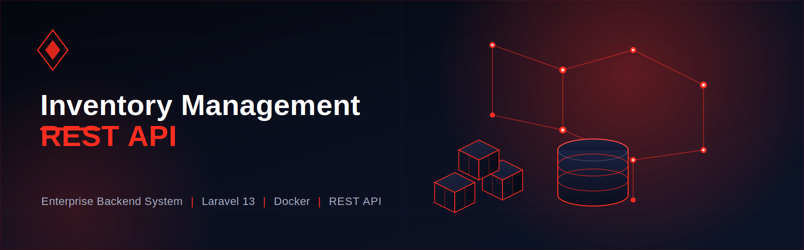

<p align="center">
  
</p>

# 🚀 Inventory Management REST API

About Laravel


A production-style **Inventory Management REST API** built with **Laravel 13** following modern backend development practices including **Repository Pattern**, **Service Layer**, **Laravel Sanctum Authentication**, **API Resources**, **Form Request Validation**, and **Docker**.

---

# 📖 Project Overview

This project is designed as an enterprise-level Inventory Management backend that provides secure REST APIs for managing inventory, products, suppliers, customers, purchases, sales, and stock management.

The goal of this project is to demonstrate professional Laravel backend architecture and REST API development practices.

---

# ✨ Current Features

## ✅ Authentication Module

- User Registration
- User Login
- User Logout
- Forgot Password
- Reset Password
- Change Password
- Email Verification
- Laravel Sanctum Authentication
- Password Hashing
- API Token Authentication

---

## ✅ Category Module

- Create Category
- Get All Categories
- Get Single Category
- Update Category
- Delete Category
- Pagination
- Validation
- API Resources

---

# 🚧 Upcoming Modules

- Product Management
- Brand Management
- Supplier Management
- Customer Management
- Purchase Management
- Sales Management
- Warehouse Management
- Stock Management
- Reports
- Dashboard APIs
- Notifications
- Roles & Permissions
- Activity Logs

---

# 🛠 Tech Stack

| Technology         | Version |
| ------------------ | ------- |
| Laravel            | 13      |
| PHP                | 8.4     |
| MySQL              | 8       |
| Docker             | Latest  |
| Laravel Sanctum    | ✔       |
| REST API           | ✔       |
| Repository Pattern | ✔       |
| Service Layer      | ✔       |
| API Resources      | ✔       |
| Form Requests      | ✔       |
| Git & GitHub       | ✔       |

---

# 📁 Project Structure

```
App
├── Http
│   ├── Controllers
│   ├── Middleware
│   ├── Requests
│   └── Resources
│
├── Models
├── Repositories
├── Services
├── Providers
├── Traits

database
routes
storage
tests
```

---

# 🏗 Architecture

```
Client

   │

REST API

   │

Controller

   │

Service Layer

   │

Repository Layer

   │

Eloquent Model

   │

MySQL Database
```

---

# 🔐 Authentication Endpoints

| Method | Endpoint                |
| ------ | ----------------------- |
| POST   | /api/v1/register        |
| POST   | /api/v1/login           |
| POST   | /api/v1/logout          |
| POST   | /api/v1/forgot-password |
| POST   | /api/v1/reset-password  |
| POST   | /api/v1/change-password |
| GET    | /api/v1/email/verify    |

---

# 📂 Category Endpoints

| Method | Endpoint                |
| ------ | ----------------------- |
| GET    | /api/v1/categories      |
| POST   | /api/v1/categories      |
| GET    | /api/v1/categories/{id} |
| PUT    | /api/v1/categories/{id} |
| DELETE | /api/v1/categories/{id} |

---

# 🐳 Docker Installation

Clone the repository

```bash
git clone https://github.com/naeemahmaddev426/Inventory_Management_Rest_Api.git
```

Enter the project

```bash
cd Inventory_Management_Rest_Api
```

Build Docker Containers

```bash
docker compose up --build
```

Run in background

```bash
docker compose up -d
```

---

# 🧰 CLI via Docker

Prefer running PHP/Composer/Artisan commands inside the project's Docker container so they use the container's PHP runtime (matching dependencies).

Examples (from project root):

```bash
docker compose exec App php -v
docker compose exec App composer install
docker compose exec App php artisan route:list
```

You can also use the repository NPM scripts to run these commands (requires Node installed):

```bash
npm run artisan -- route:list
npm run composer -- install
```

This keeps your host PHP version irrelevant and avoids platform mismatches.

Quick convenience wrAppers (Windows)

From project root you can run these directly:

```powershell
.\composer.cmd install
.\artisan.cmd route:list
.\docker-composer.ps1 install
.\docker-artisan.ps1 route:list
```

Note: if you prefer running `composer` without the `.` prefix on Windows you can add the project root to your PATH, but that affects only the current system.

PowerShell dev aliases

If you use PowerShell regularly you can load project-local aliases so `composer`, `php`, and `artisan` call the container automatically. From the project root run:

```powershell
.\dev-aliases.ps1
# now `composer install` runs inside the App container
composer install
php artisan route:list
```

To enable the aliases permanently for your user add this line to your PowerShell profile (only do this if you understand it will shadow host `php`/`composer` in PowerShell):

```powershell
Add-Content $PROFILE "`. $PWD\dev-aliases.ps1`"
```

# 🌐 Application URLs

Laravel API

```
http://localhost:8002
```

phpMyAdmin

```
http://localhost:8083
```

---

# ⚙ Environment

Copy the environment file

```bash
cp .env.example .env
```

Generate Application Key

```bash
php artisan key:generate
```

Run Migrations

```bash
php artisan migrate
```

---

# 🧪 API Testing

The APIs are tested using:

- Postman
- REST Client
- JSON Responses

---

# 📌 Development Practices

- RESTful API Standards
- Clean Architecture
- Repository Pattern
- Service Layer
- API Resource Responses
- Request Validation
- Secure Authentication
- Dockerized Environment
- Versioned APIs
- Git Workflow

---

# 📈 Project Status

| Module             | Status         |
| ------------------ | -------------- |
| Authentication     | ✅ Completed   |
| Password Reset     | ✅ Completed   |
| Email Verification | ✅ Completed   |
| Category CRUD      | ✅ Completed   |
| Product Module     | 🚧 In Progress |
| Supplier Module    | ⏳ Planned     |
| Customer Module    | ⏳ Planned     |
| Purchase Module    | ⏳ Planned     |
| Sales Module       | ⏳ Planned     |

---

## 👨‍💻 Author

Naeem Ahmad

Backend Laravel Developer

GitHub

https://github.com/naeemahmaddev426

---

## ⭐ Support

If you like this project, don't forget to star this repository.

---

## 📄 License

This project is licensed under the MIT License.
